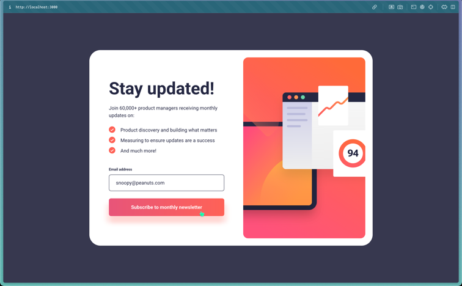
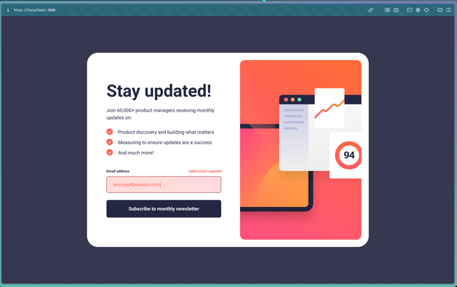
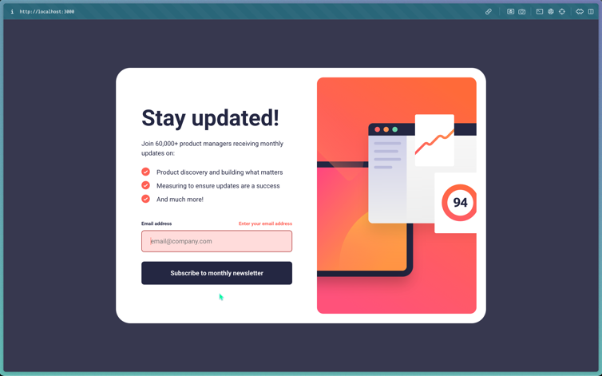
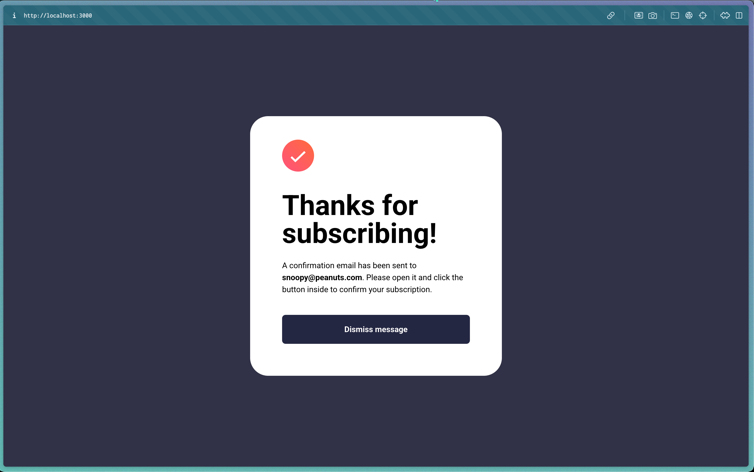

# Frontend Mentor - Newsletter sign-up form with success message solution

This is a solution to the [Newsletter sign-up form with success message challenge on Frontend Mentor](https://www.frontendmentor.io/challenges/newsletter-signup-form-with-success-message-3FC1AZbNrv). Frontend Mentor challenges help you improve your coding skills by building realistic projects.

## Table of contents

- [Frontend Mentor - Newsletter sign-up form with success message solution](#frontend-mentor---newsletter-sign-up-form-with-success-message-solution)
  - [Table of contents](#table-of-contents)
  - [Overview](#overview)
    - [Screenshot](#screenshot)
      - [Mobile Screenshots](#mobile-screenshots)
  - [Desktop Screenshots](#desktop-screenshots)
    - [Links](#links)
    - [Built with](#built-with)
    - [What I learned](#what-i-learned)

## Overview

This is a small JavaScript project that allows users to sign up for a newsletter and receive a success message. It's a mock sign-up form in which a user can enter their email address and submit it. After submission the form is validated and the success message is displayed if the email address is valid. If it's invalid, an error message is displayed depending on the type of error. Also, separate styles are applied to input and button elements for hover and focus states. The form is also responsive and can be used on any screen size.

### Screenshot

#### Mobile Screenshots

<table>
  <tr>
    <td align="center"> <em>Mobile Design</em></td>
    <td align="center"> <em>Mobile Success</em></td>
  </tr>
</table>

## Desktop Screenshots

<table>
  <tr>
    <td align="center"> <em>Desktop Design</em></td>
    <td align="center"> <em>Desktop Active State</em></td>
  </tr>
  <tr>
    <td align="center"> <em>Error State 1</em></td>
    <td align="center"> <em>Error State 2</em></td>
  </tr>
  <tr>
    <td align="center"> <em>Desktop Success</em></td>
    <td align="center"> <em>Desktop Success Active State</em></td>
  </tr>
</table>

### Links

- Solution URL: [https://github.com/py-code314/newsletter-signup-form](https://github.com/py-code314/newsletter-signup-form)
- Live Site URL: [https://newsleter-signup-form.netlify.app/](https://newsleter-signup-form.netlify.app/)

### Built with

- Semantic HTML5 markup
- Sass
- Gulp
- Vanilla JavaScript
- Flexbox
- Mobile-first workflow

### What I learned

- A little about form validation and aria attributes
- Learned that by default, Safari does not allow tabbing to non-text elements (like buttons). I had to explicitly set `tabindex="0"` on button elements to make them tabbable.
